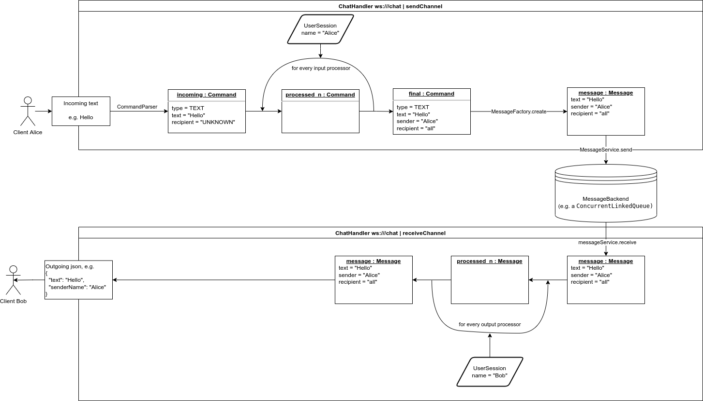

# Chatter

Simple messaging service written with spring reactive.

⚠️ Disclaimer: This project is not meant to be used in production. Use at your own risk.

Live demo: http://chatter.nyon.de

## Architecture overview

## Create docker image

Run `./build.sh`.

## Run locally

Run `docker-compose up`.
If you want to use a web client open `http://localhost:3000` in your browser.
If you want to use the CLI client run `client/run.sh` in your terminal.